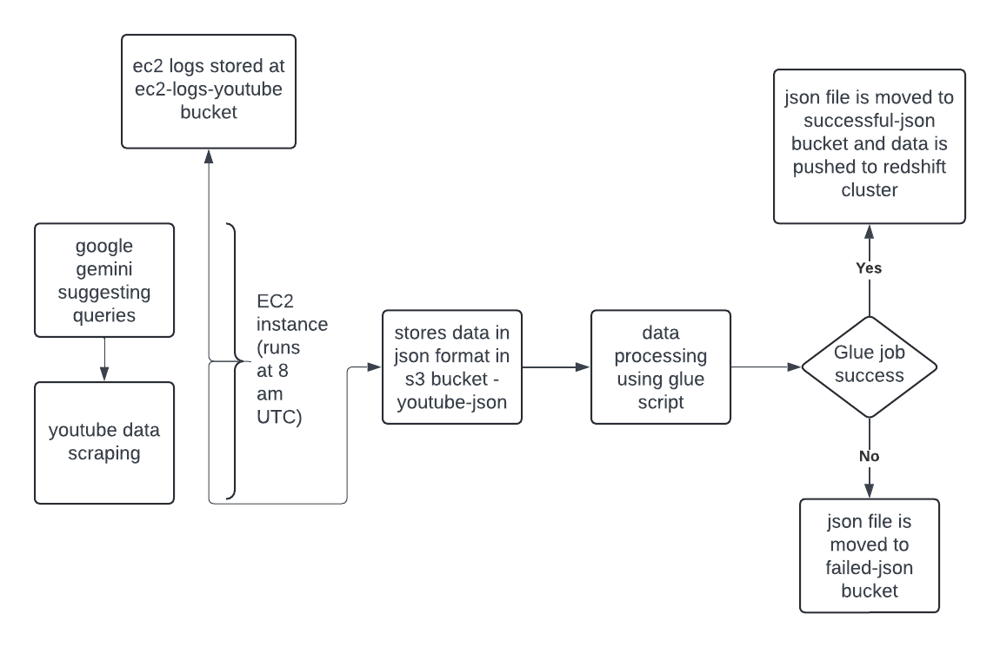

# YouTube Data Scraper and ETL Pipeline

This AWS SAM application is designed to automate the process of scraping YouTube data, processing it, and loading it into Amazon Redshift Serverless. The application deploys various AWS resources, including S3 buckets, Lambda functions, Glue jobs, and Redshift Serverless, to create an efficient and scalable data pipeline.

## Architecture

## Features

1. **S3 Buckets**: 
   - `ec2-logs-youtube`: Stores EC2 instance logs.
   - `failed-json`: Stores JSON files if Glue job fails.
   - `redshift-youtube-tmp`: Temporary storage for Redshift.
   - `script-youtube`: Stores zipped YouTube scraper scripts.
   - `successful-json`: Stores JSON files if Glue job succeeds.
   - `youtube-json`: Stores scraped YouTube data in JSON format.

2. **Redshift Serverless**:
   - Workgroup: `youtube-wg`
   - Namespace: `youtube-ns`

3. **Lambda Functions**:
   - Zips the YouTube scraper folder and uploads it to `script-youtube` bucket at 8 AM UTC.
   - Launches an EC2 instance to run the YouTube scraper script.

4. **EC2 Instance**:
   - Runs the YouTube scraper script.
   - Stores logs in `ec2-logs-youtube` bucket.
   - Terminates automatically after the scraping process is completed.

5. **Glue Job**:
   - Processes and flattens the scraped JSON data.
   - Restricts the length of the description column to 300 characters.
   - Loads the processed data into Redshift Serverless.
   - Moves JSON files to `successful-json` or `failed-json` based on the job outcome.

6. **VPC and Subnet**:
   - The deployment process takes care of creating a VPC and subnet for connecting Glue and Redshift, ensuring secure and efficient data transfer.

## Deployment

Deployment is automated using GitHub Actions. The deployment workflow is triggered on a push to the `main` branch.

### Prerequisites

- AWS Account
- AWS SAM CLI
- AWS CLI
- GitHub Secrets configured with:
  - `AWS_ACCESS_KEY_ID`
  - `AWS_SECRET_ACCESS_KEY`
  - `GOOGLE_API_KEY`
  - `ADMINUSERNAME`
  - `ADMINUSERPASSWORD`

## Usage

1. **Scraping YouTube Data**: The scraper runs daily at 8 AM UTC, scraping data from YouTube and storing it in the `youtube-json` bucket.
2. **Processing Data with AWS Glue**: The Glue job processes the scraped data and loads it into Redshift Serverless.
3. **Monitoring and Logs**: Logs from the EC2 instance and Glue job outcomes are stored in their respective S3 buckets for monitoring and debugging.
4. **Connecting to Visualization Tools**: Use the URL endpoint of the Redshift workgroup to connect it to a visualization tool for further analysis and visualization of the data.

P.S. - all these resources are created in us-east-1 region. if you cant see resources getting created in the console then please check the region of your account on top right side section of title bar  

## Steps to delete the stack

1. **Delete all the buckets created by the stack**
2. **Run below mentioned line in your terminal to delete the stack**-
    aws cloudformation delete-stack --stack-name youtube  
3. **Run below mentioned line in your terminal to delete the stack created by AWS SAM management**-
    aws cloudformation delete-stack --stack-name aws-sam-cli-managed-default

## Contributing

Contributions are welcome! Please open an issue or submit a pull request for any improvements or bug fixes.

## Contact

For any questions or support, please open an issue or contact the maintainer.
